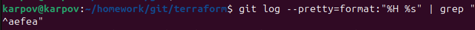
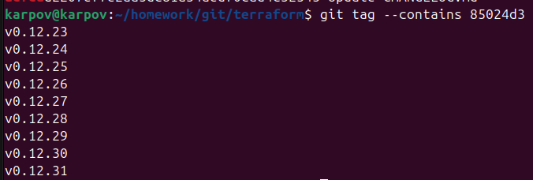
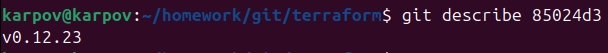
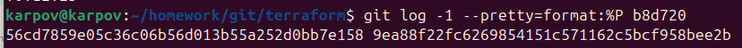
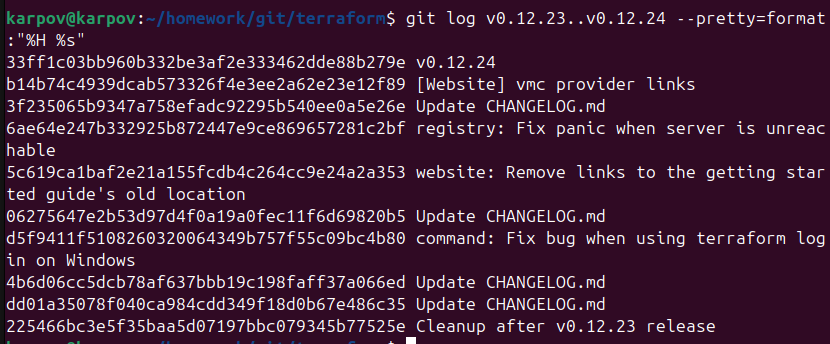
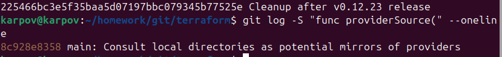
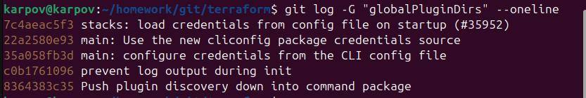
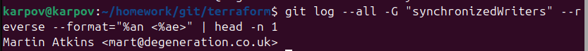

# Домашнее задание к занятию «Инструменты Git». Карпов Антон

В клонированном репозитории:

### 1.Найдите полный хеш и комментарий коммита, хеш которого начинается на aefea.

aefead2207ef7e2aa5dc81a34aedf0cad4c32545 Update CHANGELOG.md

### 2. Ответьте на вопросы.

**Какому тегу соответствует коммит 85024d3?**

v0.12.23
v0.12.24
v0.12.25
v0.12.26
v0.12.27
v0.12.28
v0.12.29
v0.12.30
v0.12.31

Для поиска ближайшего тега можно использовать git describeЭ, это будет тег v0.12.23

**Сколько родителей у коммита b8d720? Напишите их хеши.**

Их 2:

56cd7859e05c36c06b56d013b55a252d0bb7e158 9ea88f22fc6269854151c571162c5bcf958bee2b

**Перечислите хеши и комментарии всех коммитов, которые были сделаны между тегами v0.12.23 и v0.12.24.**

33ff1c03bb960b332be3af2e333462dde88b279e v0.12.24
b14b74c4939dcab573326f4e3ee2a62e23e12f89 [Website] vmc provider links
3f235065b9347a758efadc92295b540ee0a5e26e Update CHANGELOG.md
6ae64e247b332925b872447e9ce869657281c2bf registry: Fix panic when server is unreachable
5c619ca1baf2e21a155fcdb4c264cc9e24a2a353 website: Remove links to the getting started guide's old location
06275647e2b53d97d4f0a19a0fec11f6d69820b5 Update CHANGELOG.md
d5f9411f5108260320064349b757f55c09bc4b80 command: Fix bug when using terraform login on Windows
4b6d06cc5dcb78af637bbb19c198faff37a066ed Update CHANGELOG.md
dd01a35078f040ca984cdd349f18d0b67e486c35 Update CHANGELOG.md
225466bc3e5f35baa5d07197bbc079345b77525e Cleanup after v0.12.23 release

**Найдите коммит, в котором была создана функция func providerSource, её определение в коде выглядит так: func providerSource(...) (вместо троеточия перечислены аргументы).**

8c928e8358 main: Consult local directories as potential mirrors of providers

**Найдите все коммиты, в которых была изменена функция globalPluginDirs.**

Поиск по изменению содержания функции:

7c4aeac5f3 stacks: load credentials from config file on startup (#35952)
22a2580e93 main: Use the new cliconfig package credentials source
35a058fb3d main: configure credentials from the CLI config file
c0b1761096 prevent log output during init
8364383c35 Push plugin discovery down into command package

**Кто автор функции synchronizedWriters?**

Martin Atkins <mart@degeneration.co.uk>

